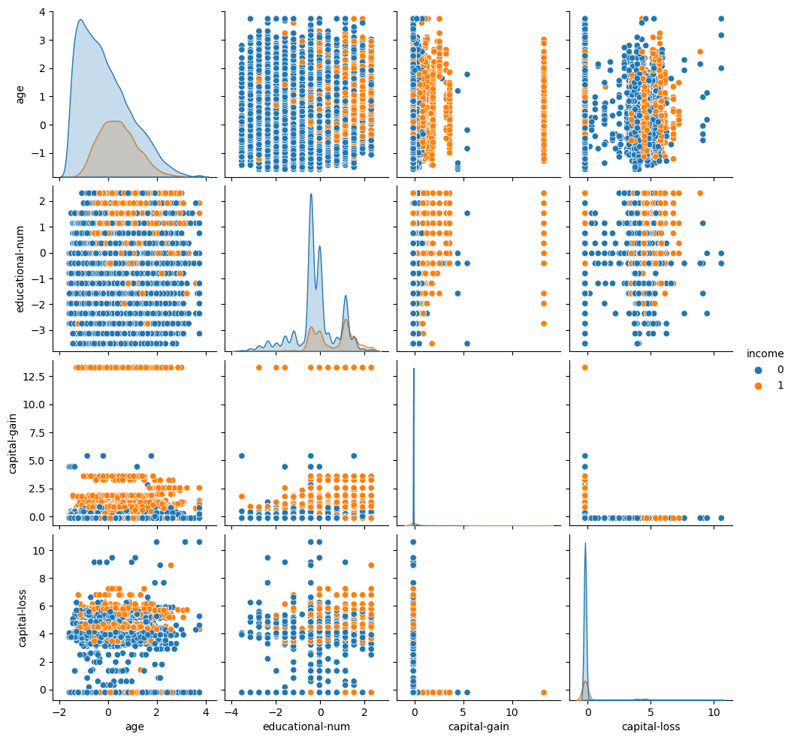
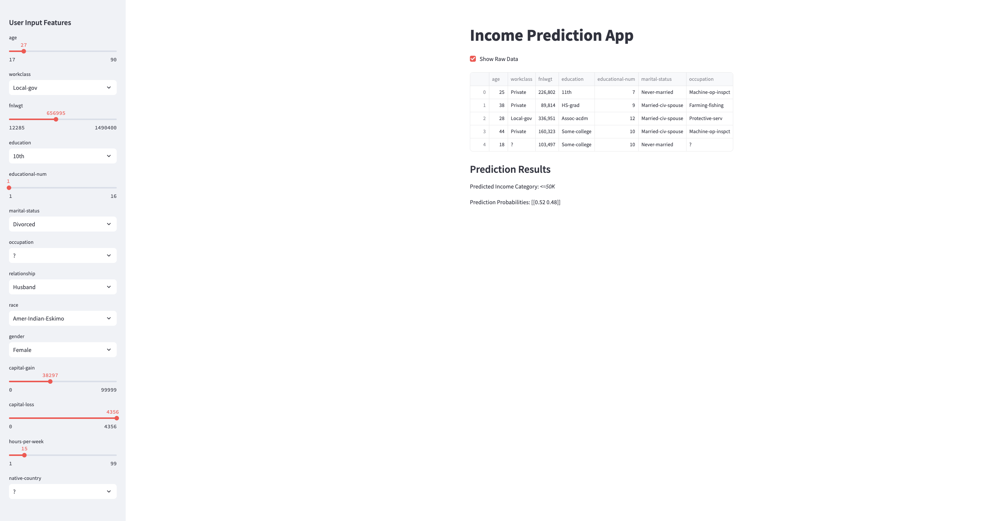

# Project Title: Income Prediction 

### Author Name: Akash Thota

**Semester:** Fall'24

**Prepared for:** UMBC Data Science Master's Degree Capstone by Dr. Chaojie (Jay) Wang

**GitHub:** [https://github.com/SURYAAKASHTHOTA/UMBC-DATA606-Capstone](https://github.com/AkashThota/UMBC-DATA606-Capstone)

**LinkedIn Profile:** [https://www.linkedin.com/in/akash-thota](https://www.linkedin.com/in/akash-thota-719030296)

**Youtube Video:** (https://youtu.be/o4OX8xK0ysQ)

**Streamlit APP:** (https://umbc-data606-capstone-cdrqkzurtu8p2ajzug7kjg.streamlit.app/)

**PowerPoint Presentation:** (./FINAL_PRESENTATION.pptx)

---

## 2. Background

### What is the project about?

This project focuses on predicting an individual's income category (greater than or less than $50K) based on the Adult dataset, which contains various demographic and work-related attributes. The goal is to use machine learning models to understand which factors most significantly impact income levels and accurately classify individuals into the appropriate income category.

### Why is it important?

Understanding income prediction can have several practical applications, including tax policy analysis, wage gap identification, and targeted economic interventions. It can also assist in policy-making decisions that aim to address inequality and improve social welfare. Accurately predicting income levels can provide insights into how factors such as education, occupation, and age influence income.

### What questions are we trying to answer?

1. **Which factors have the most impact on income prediction?**
   - This question examines the influence of attributes like education, occupation, and hours worked per week on income levels.

2. **Can machine learning accurately predict income levels?**
   - This explores the performance of various machine learning models in classifying income.

3. **Which machine learning model performs the best for income prediction?**
   - A comparison of different models (Logistic Regression, Random Forest, XGBoost) to determine the most effective one based on metrics like accuracy, precision, and F1-score.

4. **Does including demographic features such as race and gender improve prediction accuracy?**
   - This will investigate whether these demographic variables enhance model performance and whether their influence is statistically significant.

---

## 3. Data

### Datasets

The dataset used in this project is the Adult dataset, which was extracted from the UCI Machine Learning Repository. It includes data on various personal attributes such as age, education, occupation, and income.

### Data Sources

- **Source:** UCI Machine Learning Repository
- **Files:** `adult.csv`

### Data Size

- `adult.csv`: [3.9 MB]

### Data Shape

- **Total instances:** 48,842 rows, 15 columns (after removing missing values, there are 45,222 rows)

### Time Period

The dataset is derived from the 1994 US Census.

### Each Row Represents

Each row represents a single individual with attributes such as their age, education, marital status, and occupation, along with their corresponding income class (`<=50K` or `>50K`).

### Data Dictionary

| Column Name      | Data Type    | Definition                                                  | Potential Values                                               |
|------------------|--------------|--------------------------------------------------------------|----------------------------------------------------------------|
| Age              | Numerical    | Age of the individual                                         | Numeric values (e.g., 25, 40)                                  |
| Workclass        | Categorical  | Type of employment                                            | Private, Self-emp, Gov, etc.                                   |
| fnlwgt           | Numerical    | Final weight used to project national population estimates    | Numeric values                                                 |
| Education        | Categorical  | Education level                                               | Bachelors, HS-grad, Masters, etc.                              |
| Education-num    | Numerical    | Number of years of education                                  | Numeric values (e.g., 10, 12, 16)                              |
| Marital-status   | Categorical  | Marital status of the individual                              | Married, Never-married, Divorced                               |
| Occupation       | Categorical  | Type of job                                                   | Exec-managerial, Sales, Adm-clerical, etc.                     |
| Relationship     | Categorical  | Family relationship                                           | Husband, Wife, Own-child, etc.                                 |
| Race             | Categorical  | Race of the individual                                        | White, Asian, Black, etc.                                      |
| Sex              | Categorical  | Gender                                                        | Male, Female                                                   |
| Capital-gain     | Numerical    | Income from investment sources                                | Numeric values                                                 |
| Capital-loss     | Numerical    | Loss from investment sources                                  | Numeric values                                                 |
| Hours-per-week   | Numerical    | Number of hours worked per week                               | Numeric values (e.g., 40, 60)                                  |
| Native-country   | Categorical  | Country of origin                                             | United States, Mexico, Germany, etc.                           |
| Income           | Categorical  | Income category                                               | `<=50K`, `>50K` (Target variable)                              |

### Target/Label

- **Target Variable:** The target variable is "Income", which categorizes individuals into two income brackets: `<=50K` or `>50K`.

### Features/Predictors

The following columns are selected as features in the machine learning model:

- Age
- Workclass
- Education
- Marital-status
- Occupation
- Relationship
- Race
- Sex
- Capital-gain
- Capital-loss
- Hours-per-week
- Native-country

These predictors help the model learn the relationship between demographic factors and income classification.

---

## Dataset Details

### `adult.csv`

**Shape:** 48,842 rows and 15 columns

**Columns:**

- **age**: Age of the individual
- **workclass**: Employment type
- **fnlwgt**: Census weighting factor
- **education**: Highest education level attained
- **education-num**: Number of years of education
- **marital-status**: Marital status of the individual
- **occupation**: Type of job held
- **relationship**: Family role
- **race**: Race of the individual
- **sex**: Gender
- **capital-gain**: Capital gains
- **capital-loss**: Capital losses
- **hours-per-week**: Hours worked per week
- **native-country**: Country of origin
- **income**: Income class (target variable)

---

In this project, the target variable will be the "income" from the `adult.csv` file, and potential features for the machine learning model will include demographic and work-related factors like:

- Age
- Workclass
- Education
- Marital-status
- Occupation
- Relationship
- Race
- Sex
- Capital-gain
- Capital-loss
- Hours-per-week
- Native-country

These features will be used to predict whether an individual earns `<=50K` or `>50K`.

### **b. Data Preprocessing:**
1. **Encoding Categorical Features:** 
   - Transforming categorical variables (e.g., Gender, Workclass) into numerical formats using techniques like one-hot encoding and label encoding.
   
2. **Handling Missing Data:**
   - Removing or imputing missing values in attributes such as Workclass, Occupation, and Native Country.
   
3. **Scaling Numerical Features:**
   - Standardizing continuous variables (e.g., Age, Hours Per Week) using MinMaxScaler for uniform scaling.

---

## **4. Exploratory Data Analysis (EDA)**

### **a. Visualizing Relationships Between Variables**
In this section, we aim to visualize the relationships between various features and the target variable (`Income`). Understanding how the features correlate with the target is essential for selecting relevant features for modeling.

- **Visualization:**
   

### **b. Boxplot for Outlier Detection**
Boxplots help in detecting outliers in numerical features such as `Age` and `Hours Per Week`. These outliers could potentially impact the model's performance and should be considered for possible removal or transformation.

- **Visualization:**
   

### **c. Distribution of Numeric Features**
Understanding the distribution of numeric features such as `Age` and `Hours Per Week` is crucial for identifying skewed data, which may need transformation (e.g., log transformation) before modeling.

- **Visualization:**
   

### **d. Distribution of Income**
This visualization shows the distribution of the target variable `Income` (`<=50K` vs `>50K`). The distribution reveals that the dataset is imbalanced, with a larger proportion of instances in the `<=50K` category. This imbalance needs to be addressed to avoid biasing the model toward the majority class.

- **Visualization:**
   

---

## 5. Model Training and Evaluation

### Models Used:
1. Logistic Regression
2. Random Forest Classifier
3. Support Vector Machine (SVM)
4. XGBoost Classifier

### Training Approach:
- **Train-Test Split:** 80% training, 20% testing.
- **Hyperparameter Tuning:** Performed GridSearchCV for optimal parameters.

### Evaluation Metrics:
- Accuracy, Precision, Recall, and F1-Score.

#### Results:

| **Model**            | **Accuracy** | **Precision** | **Recall** | **F1-Score** |
|-----------------------|--------------|---------------|------------|--------------|
| Logistic Regression   | 85.70%      | 73.71%        | 60.61%     | 66.52%       |
| Random Forest         | 85.96%      | 72.90%        | 63.80%     | 68.05%       |
| SVM                   | 85.73%      | 74.94%        | 58.78%     | 65.88%       |
| **XGBoost**           | **87.50%**  | **76.42%**    | **67.51%** | **71.69%**   |

---

## 6. Application of Trained Models

### Web App
A **Streamlit** web app was developed for real-time predictions. 
    

#### Features:
- User-friendly interface for data input (Age, Education, Occupation, etc.).
- Real-time income classification as `<=50K` or `>50K`.

#### Benefits:
- Simplifies model usage for non-technical users.
- Facilitates quick decision-making with intuitive outputs.

---

## 7. Conclusion

### Key Takeaways:
- **XGBoost** emerged as the best model with an accuracy of 87.50%.  
- Features like education, hours-per-week, and occupation strongly influence income.  

### Limitations:
- Class imbalance in the dataset affects model performance.  
- Limited feature set from the dataset; external data could improve predictions.  

### Future Work:
- Experiment with advanced models like Neural Networks.  
- Incorporate additional features (e.g., socioeconomic data).  

---

## 8. References
- [UCI Machine Learning Repository - Adult Dataset](https://archive.ics.uci.edu/ml/datasets/adult)
- Documentation on Python libraries: scikit-learn, XGBoost, Streamlit.
- Articles and blogs on data preprocessing and machine learning.

---

**Author:** Akash Thota  
[GitHub Repository](https://github.com/SURYAAKASHTHOTA/UMBC-DATA606-Capstone) | [LinkedIn Profile](https://www.linkedin.com/in/akash-thota-719030296)  
