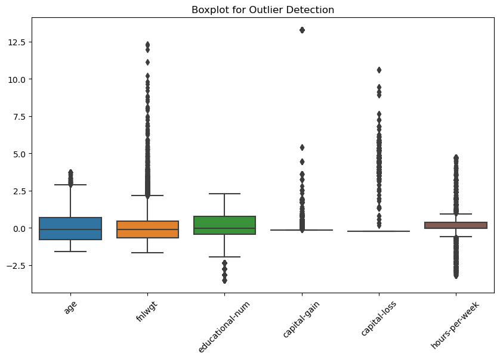
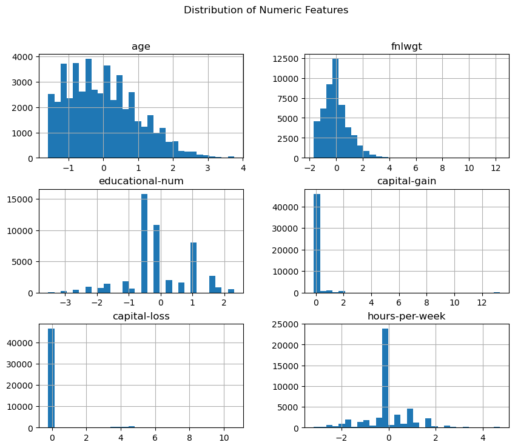
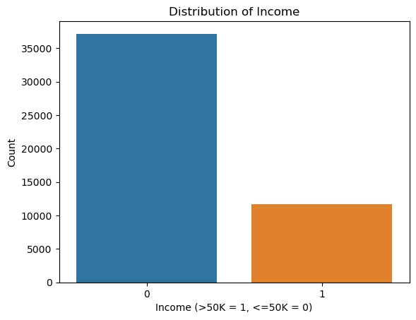

# **Income Prediction - Machine Learning Project**

---

## **1. Problem Overview**

The objective of this project is to predict whether an individual's annual income exceeds $50,000 based on demographic and employment-related attributes. Using machine learning, we aim to build a classification model that can accurately determine income levels based on input features.

---

## **2. Data Overview**

### **a. Dataset Description:**
The dataset is derived from the UCI Machine Learning Repository and consists of various attributes related to demographic and employment details. 

The key attributes include:
- **Age**: Age of the individual in years.
- **Workclass**: Employment sector (e.g., Private, Self-employed).
- **Education**: Highest level of education achieved.
- **Marital Status**: Marital status of the individual.
- **Occupation**: Type of job (e.g., Tech Support, Craft Repair).
- **Relationship**: Family role (e.g., Husband, Wife, Own-child).
- **Race**: Race category (e.g., White, Black, Asian).
- **Gender**: Male or female.
- **Hours Per Week**: Hours worked per week.
- **Native Country**: Country of origin.
- **Income**: Target variable indicating income class (`<=50K` or `>50K`).

### **b. Data Preprocessing:**
1. **Encoding Categorical Features:** 
   - Transforming categorical variables (e.g., Gender, Workclass) into numerical formats using techniques like one-hot encoding and label encoding.
   
2. **Handling Missing Data:**
   - Removing or imputing missing values in attributes such as Workclass, Occupation, and Native Country.
   
3. **Scaling Numerical Features:**
   - Standardizing continuous variables (e.g., Age, Hours Per Week) using MinMaxScaler for uniform scaling.

---

## **3. Exploratory Data Analysis (EDA)**

### **a. Visualizing Relationships Between Variables**
In this section, we aim to visualize the relationships between various features and the target variable (`Income`). Understanding how the features correlate with the target is essential for selecting relevant features for modeling.

- **Visualization:**
   

### **b. Boxplot for Outlier Detection**
Boxplots help in detecting outliers in numerical features such as `Age` and `Hours Per Week`. These outliers could potentially impact the model's performance and should be considered for possible removal or transformation.

- **Visualization:**
   

### **c. Distribution of Numeric Features**
Understanding the distribution of numeric features such as `Age` and `Hours Per Week` is crucial for identifying skewed data, which may need transformation (e.g., log transformation) before modeling.

- **Visualization:**
   

### **d. Distribution of Income**
This visualization shows the distribution of the target variable `Income` (`<=50K` vs `>50K`). The distribution reveals that the dataset is imbalanced, with a larger proportion of instances in the `<=50K` category. This imbalance needs to be addressed to avoid biasing the model toward the majority class.

- **Visualization:**
   

---

## **4. Data Splitting**

The dataset was divided into training and testing sets using an 80-20 split. This ensures the model is trained on the majority of the data while reserving a portion for evaluating generalization performance.

```python
from sklearn.model_selection import train_test_split

# Features (X) and target variable (y)
X = data.drop(columns=["Income"])  # Assuming 'Income' is the target column
y = data["Income"]

# Split the data into training (80%) and testing (20%) sets
X_train, X_test, y_train, y_test = train_test_split(X, y, test_size=0.2, random_state=42)

# Display the shape of the datasets
print(f"Training set shape: {X_train.shape}")
print(f"Testing set shape: {X_test.shape}")
